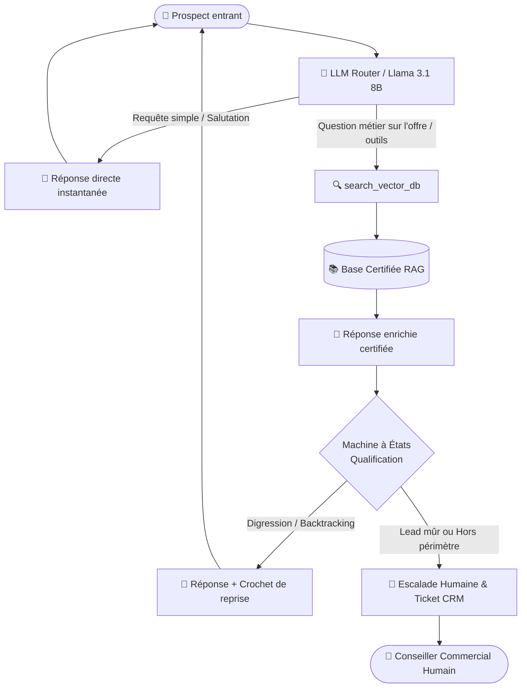

# 🏠 ImmoPredict AI — Assistant IA de Triage & Qualification de Leads
### *Frontline AI Concierge : Zéro temps d'attente, RAG fermé certifié & Transfert commercial qualifié*

[](https://www.python.org/)
[](https://gradio.app/)
[](https://huggingface.co/meta-llama/Llama-3.1-8B-Instruct)
[](https://scikit-learn.org/)
[](https://docs.pytest.org/)

---

## 🎯 Problématique Métier

> **Le défi :** **Débordement des équipes commerciales et supports** face à l'accumulation continue des sollicitations entrantes (formulaires web, chats, e-mails).
>
> **L'impact :** Cette saturation engendre une **latence de réponse critique**, frustre les prospects et provoque une **déperdition majeure de leads qualifiés** au profit de la concurrence.

---

## ⚡ Missions de l'Assistant

L'assistant virtuel **ImmoPredict AI** agit comme un premier point de contact intelligent (*Frontline AI Concierge*) avec 4 missions fondamentales :

1. **⚡ Accueillir instantanément chaque nouvel entrant (zéro temps d'attente) :**  
   Prise en charge 24/7 dès la première seconde. Aucune friction à l'entrée du tunnel de conversion.
2. **📚 Répondre exclusivement aux questions du périmètre de l'entreprise via une base documentaire certifiée (RAG strict) :**  
   Moteur de recherche vectoriel fermé (sans hallucination). L'assistant s'appuie uniquement sur les fiches certifiées d'ImmoPredict AI et refuse poliment d'extrapoler sur des sujets non validés.
3. **🧭 Qualifier progressivement le lead au rythme souhaité par le prospect :**  
   Grâce à une machine à états souple (Pilier 3), le prospect avance librement. S'il pose une question antérieure ou digresse, l'assistant répond avec bienveillance puis propose naturellement de revenir au palier de qualification le plus avancé (*High-Water Mark*).
4. **🤝 Transférer le dossier complet à un conseiller humain dès que le prospect est mûr ou qu'une question dépasse le champ de compétence :**  
   Dès la qualification finalisée (besoin, budget, localisation) ou dès qu'une expertise sur-mesure / hors-périmètre est requise, un ticket CRM structuré est généré automatiquement avec l'historique complet pour une prise en charge humaine sans répétition.

---

## 🏗️ Architecture & Flux Décisionnel

Le système implémente le cycle de décision suivant :



---

## 🧭 Machine à États de Qualification (Pilier 3)

La qualification suit une progression naturelle tout en tolérant le retour en arrière sans blocage :

| Étape | Statut | Objectif de l'échange |
| :--- | :--- | :--- |
| **Palier 1** | `STATE_1_SERVICES` | Présentation de la mission et des outils ImmoPredict AI. |
| **Palier 2** | `STATE_2_NEED` | Identification du type de projet (Achat résidence, Investissement locatif, Location). |
| **Palier 3** | `STATE_3_DEEPER_QUALIF` | Recueil du budget, surface, horizon d'investissement et commune ciblée. |
| **Palier 4** | `STATE_4_HANDOVER` | Clôture de la qualification, génération du ticket CRM et transmission au conseiller. |

---

## 🛠️ Outils Prédictifs Disponibles via l'Interface

En complément du chatbot conversationnel, l'interface web Gradio donne un accès direct aux 3 moteurs décisionnels d'ImmoPredict AI :

1. **📍 Faisabilité & Opportunité d'un Projet :**  
   Calcul du taux d'effort, confrontation au revenu moyen des foyers de la commune, vacance locative et arbitrage achat vs location.
2. **📈 Rentabilité Prévisionnelle à 2 ans :**  
   Projection financière dynamique intégrant l'Indice de Référence des Loyers (IRL), charges/taxes, plus-value prévisionnelle et ROI net.
3. **🏆 Recommandation Intelligente de Communes :**  
   Scoring multicritère classant les meilleures villes selon le budget, le rendement locatif brut et la tension du marché.

---

## 💻 Structure du Projet

```
Immo/
├── app.py                          # Point d'entrée principal Hugging Face Spaces (Gradio)
├── main.py                         # Point d'entrée local alternatif
├── config/
│   └── settings.py                 # Configuration centrale & variables d'environnement
├── data/
│   └── knowledge_base/
│       └── company_knowledge.md    # Base certifiée officielle (Source de vérité RAG)
├── src/
│   ├── core/
│   │   ├── agent.py                # Orchestrateur conversationnel & routage LLM
│   │   ├── rag.py                  # Moteur RAG fermé (TF-IDF scikit-learn strict)
│   │   ├── state_machine.py        # Machine à états souple & High-Water Mark
│   │   ├── handover.py             # Gestionnaire d'escalade CRM
│   │   ├── guardrails.py           # Filtre de sécurité bas niveau
│   │   └── prompts.py              # Prompts système anti-hallucination
│   ├── integrations/
│   │   └── mcp_server/             # Outils métier (faisabilité, rentabilité, zonage)
│   └── interface/
│       ├── ui.py                   # Interface utilisateur Gradio complète
│       └── charts.py               # Graphiques interactifs Plotly
├── tests/                          # 13 tests automatisés unitaires et d'intégration
├── requirements.txt                # Dépendances Python du projet
└── .github/workflows/
    └── deploy_hf.yml               # Déploiement continu automatique vers Hugging Face
```

---

## 🚀 Démarrage Rapide

### 1. Installation en local

```bash
# Cloner le dépôt
git clone https://github.com/ryliam/ImmoPredict.git
cd ImmoPredict

# Créer l'environnement virtuel
python -m venv venv
.\venv\Scripts\activate  # Windows
# source venv/bin/activate  # Linux/macOS

# Installer les dépendances
pip install -r requirements.txt
```

### 2. Configuration des Variables d'Environnement

Créez un fichier `.env` à la racine :

```env
# Jeton Hugging Face pour l'accès au modèle Llama-3.1 via le Router d'inférence
HF_TOKEN=hf_votre_token_ici

# Optionnel (valeurs par défaut déjà intégrées)
HF_MODEL=meta-llama/Llama-3.1-8B-Instruct:deepinfra
HF_BASE_URL=https://router.huggingface.co/v1
```

### 3. Lancer l'Application

```bash
python app.py
```
Accédez ensuite à l'interface dans votre navigateur à l'adresse `http://localhost:7860`.

### 4. Lancer les Tests

```bash
python -m pytest tests/
```

---

## 🌐 Déploiement Continu (CI/CD)

Le projet intègre un pipeline GitHub Actions (`.github/workflows/deploy_hf.yml`).  
Tout `git push origin main` synchronise automatiquement et sans manipulation manuelle le code sur le **Hugging Face Space** :  
👉 **[Hugging Face Space — ImmoPredict AI](https://huggingface.co/spaces/Daryl12/immopredict-ai)**
